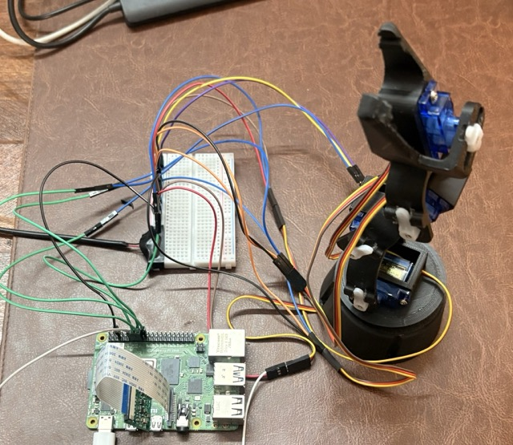

# grippybot

A cheap entry point to imitation learning on real hardware. A $15 3D-printed robot arm that learns to pick things up through behavior cloning.

This project demonstrates the entire imitation learning pipeline: hardware assembly, servo calibration, teleoperation, data collection, ACT policy training, and real robot evaluation. The ACT implementation is pure PyTorch (no LeRobot, no Accelerate), written to be readable and modifiable. Layers can be swapped, the vision backbone can be replaced, different policies can be plugged in.

The project is open to contributions: better training, better evaluation, better teleop, more cameras and sensors on this cheap and lean setup are more than welcome. See [CONTRIBUTING.md](CONTRIBUTING.md).



## Results

52 teleoperated demos, 100K training steps on a rented RTX 4080S ($0.2 total), evaluated on the real robot:

| Position | Success Rate |
|----------|-------------|
| Center   | 4/10 (40%)  |
| Left     | 2/10 (20%)  |
| Right    | 1/10 (10%)  |
| **Total**| **7/30 (23%)** |

Offline validation: 0.68 degrees mean joint error, 99.6% gripper accuracy.


## Pretrained Checkpoint

A trained checkpoint is available on HuggingFace for direct inference or fine-tuning:

**[aryanmadhavverma/grippybot](https://huggingface.co/aryanmadhavverma/grippybot)**

- 18.7M params, d_model=256, 100K steps, trained on 52 demos
- Can be used as-is for evaluation or as a starting point for further training

```bash
# Download and evaluate:
hf download aryanmadhavverma/grippybot act_reach_and_pick_tissue.pt --local-dir checkpoints/
grippybot-eval --mode offline --checkpoint checkpoints/act_reach_and_pick_tissue.pt --data_dir data/
```

## Hardware

| Part | Cost (approx) |
|------|---------------|
| 3D-printed Grippy Bot arm ([STL files](assembly/)) | depends on printer |
| 5x SG90 micro servos | ~$5 |
| Raspberry Pi 4 | ~$35 (or any SBC) |
| Pi Camera Module (5MP) | ~$10 |
| 5V 3A DC power supply | ~$5 |
| Breadboard + jumper wires | ~$3 |

**This is our setup. The pipeline works with any hardware.** The servo driver and camera are a Raspberry Pi reference implementation. See [hardware README](grippybot/hardware/README.md) for the interface contract and [Pi setup guide](grippybot/hardware/PI_SETUP.md) for flashing the OS, wiring, and copying files. Contributors can add support for Arduino, Jetson Nano, USB cameras, etc.

## Setup

```bash
git clone https://github.com/AryanMadhavVerma/grippybot.git
cd grippybot
python3 -m venv .venv
source .venv/bin/activate
pip install -e .

# On Raspberry Pi (for servo control + camera):
pip install -e ".[pi]"
```

## Quick Start: Pick Up Tissue

### 1. Calibrate servos
```bash
# On Pi, find safe pulse width ranges for each joint:
python scripts/servo_test.py
# Update grippybot/config.py with the measured values
```

### 2. Collect demos
```bash
# On Pi, teleoperate and record ~50 episodes:
grippybot-teleop
# Press T to start/stop recording. Episodes saved to data/
```

### 3. Train
```bash
# On a machine with GPU (Vast.ai, local, etc.):
grippybot-train --data_dir data/ --device cuda
# ~2.7 hours on RTX 4080S for 100K steps
```

### 4. Evaluate
```bash
# Offline (replay training data):
grippybot-eval --mode offline --data_dir data/

# On real robot (Pi runs camera + servos, Mac runs model):
# Terminal 1 (Pi):
grippybot-server --port 5555
# Terminal 2 (Mac):
grippybot-client --host raspi.local --port 5555
```

## Run Your Own Task

The pipeline is task-agnostic. "Pick up tissue" is just the first experiment.

1. Collect demos for your task: `grippybot-teleop` (saves to `data/`)
2. Train: `grippybot-train --data_dir data/`
3. Evaluate: `grippybot-eval --data_dir data/`

Nothing in the model or training code is hardcoded to any specific task.

## Architecture

```
Image [B, 3, 480, 640]
  > VisionBackbone (ResNet18, 300 visual tokens)
  > ObservationFuser (4-layer transformer encoder, fuses vision + state + latent z)
  > ActionDecoder (50 learned queries, 1-layer transformer decoder)
  > predicted_actions [B, 50, 5]  (50 future timesteps x 5 joints)
```

18.7M parameters. Pure PyTorch, no LeRobot, no HuggingFace Accelerate. See [model README](grippybot/model/README.md) for details.

## Project Structure

```
grippybot/
├── config.py              hardware constants (GPIO pins, angle ranges)
├── hardware/              servo driver + camera (Pi reference implementation)
├── teleop/                keyboard teleoperation + data recording
├── model/                 ACT architecture + dataset + temporal ensemble
├── training/              training loop
├── evaluation/            offline validation + robot inference
└── inference/             distributed Pi<>Mac inference over TCP
scripts/
├── servo_test.py          interactive servo calibration
└── convert_dataset.py     LeRobot format conversion (reference)
tests/                     unit tests (run with pytest)
assembly/                  STL files, photos, assembly guide
```

## Testing

```bash
pip install -e ".[dev]"
pytest tests/ -v
```

## Contributing

See [CONTRIBUTING.md](CONTRIBUTING.md) for open problems and how to help. Key areas: more demos, better teleop, GPU benchmarking, new tasks, alternative policies.

## Credits

- Arm design: [Roboteurs](https://roboteurs.com/) Grippy Bot
- ACT paper: [Learning Fine-Grained Bimanual Manipulation with Low-Cost Hardware](https://arxiv.org/abs/2304.13705) (Zhao et al., 2023)
- Built by [@AryanMadhavVerma](https://github.com/AryanMadhavVerma)
