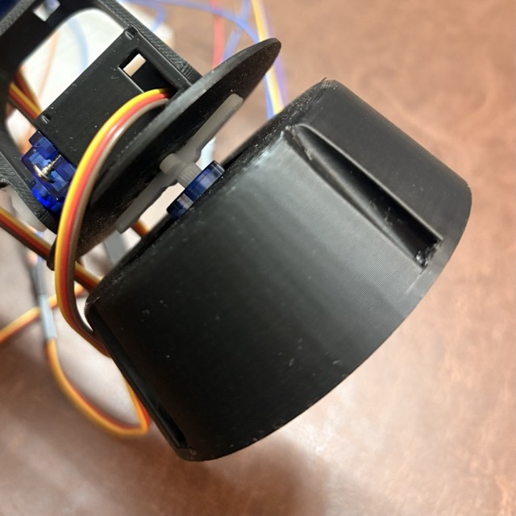
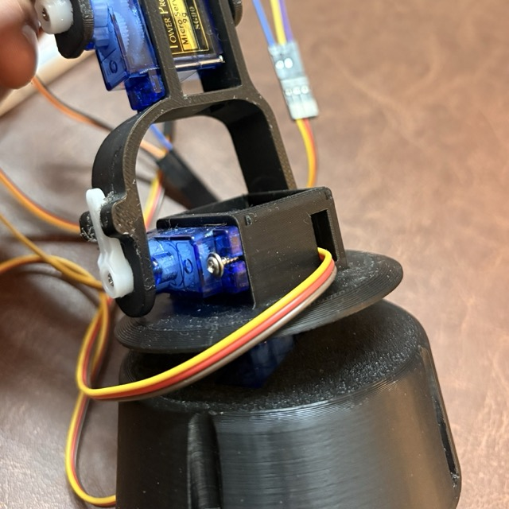
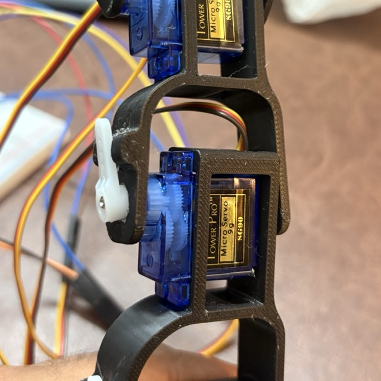
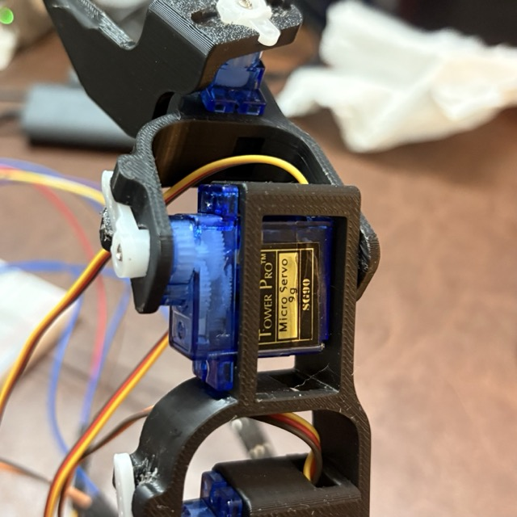
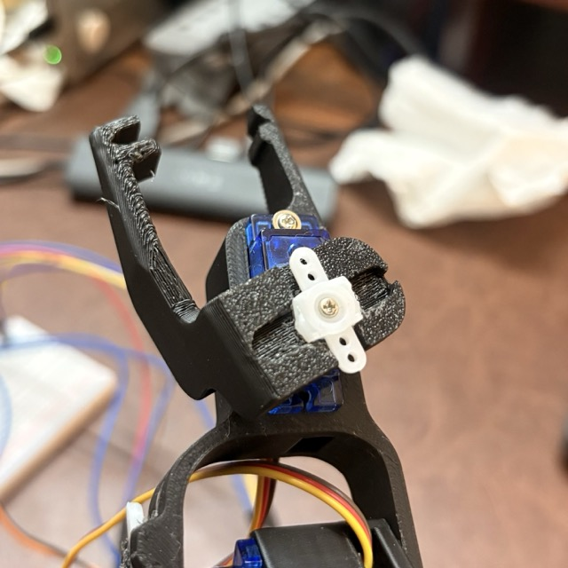

# Assembly Guide

Step-by-step instructions for assembling the Grippy Bot arm from 3D-printed parts and SG90 servos.

**STL source**: [Roboteurs](https://roboteurs.com/). Credit to them for the original Grippy Bot design.

## Print Settings

- Material: PLA
- Layer height: 0.2mm
- Infill: 20-30%
- Supports: yes (for overhangs on the gripper mechanism)

## What You Need

- 5x SG90 micro servos
- 3D-printed parts (STL files in this folder)
- Small screws (usually come with the servos)
- A knife or file for widening tight fits

## Assembly Steps

### 1. Base
The servo horn (white plastic piece) is glued to the rotating base plate with strong adhesive (feviquick/super glue).


### 2. Shoulder


### 3. Elbow


### 4. Wrist


### 5. Gripper


## Tips

- **Tight fits**: The 3D-printed housings are designed for a tight press-fit. If a servo won't go in, widen the slot slightly with a knife. Don't force it or the plastic will crack.
- **Screwing helps**: Where possible, use the small screws that come with SG90 servos to secure them. Press-fit alone can slip under load.
- **Carving for accuracy**: Some printed parts may need slight carving/filing where layers didn't print cleanly. A craft knife works well.
- **Servo horn alignment**: Before screwing in the horn, power the servo and send it to center (1500us) so the horn is aligned to the midpoint of its range.
- **Don't overtighten**: SG90 gears are plastic. Overtightening screws or forcing parts can strip the gears.

## Wiring

After assembly, wire all servos to the breadboard and Pi. See [hardware README](../grippybot/hardware/README.md) for the GPIO pin map and wiring details.

## Calibration

Once assembled and wired, run the servo tester to find safe ranges:

```bash
python scripts/servo_test.py
```

Record the min/max pulse widths per joint, then update `grippybot/config.py`.
